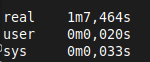

# Relatório – Laboratório Hadoop e Spark

## Identificação
**Curso:** Engenharia de Software – PSPD  
**Professor:** Fernando W. Cruz  
**Aluno(s):** 
- Pedro Henrique Nogueira Bragança  
- 

**Data:** 14/11/2025

## 1. Introdução
O objetivo desta atividade é explorar os conceitos de Big Data e processamento distribuído através da experimentação prática com dois dos principais frameworks do ecossistema: Apache Hadoop e Apache Spark.

Este relatório documenta as etapas de configuração, teste e análise de um cluster Hadoop (Item B1), focado em sua arquitetura, escalabilidade e tolerância a falhas.

## 2. Experimento com Hadoop
### 2.1. Arquitetura e configuração

Para atender aos requisitos do Item B1, foi montado um cluster Hadoop em modo totalmente distribuído utilizando Docker e Docker Compose (v2). A arquitetura foi planejada para simular um ambiente real com separação clara entre os serviços mestre (master) e escravo (worker/slave).

A arquitetura final é composta por 6 containers em uma rede bridge (hadoop):

- Serviços Mestre (2):
    - namenode: O nó mestre do HDFS (Hadoop Distributed File System). Gerencia os metadados do sistema de arquivos e a localização dos blocos de dados.
    - resourcemanager: O nó mestre do YARN (Yet Another Resource Negotiator). Gerencia os recursos do cluster e escalona a execução das aplicações (jobs).
- Serviços Escravos (4, compondo 2 nós de trabalho):
    - datanode1 e nodemanager1: O primeiro nó de trabalho. O datanode armazena os blocos de dados do HDFS e o nodemanager executa as tarefas (Map/Reduce) gerenciadas pelo YARN.
    - datanode2 e nodemanager2: O segundo nó de trabalho, idêntico ao primeiro, garantindo a distribuição e replicação dos dados e do processamento.

### 2.2. Experimentos e alterações
### 2.3. Testes de tolerância a falhas

real	1m7,464s
user	0m0,020s
sys	0m0,033s

### 2.4. Resultados e conclusões

## 3. Experimento com Spark
- Configuração e ferramentas
- Consumo de dados
- Visualização dos resultados
- Dificuldades e aprendizados

## 4. Conclusão
- Comparação entre Hadoop e Spark
- Reflexões individuais dos integrantes

## 5. Anexos
- Configurações
- Prints e gráficos
- Comandos utilizados
